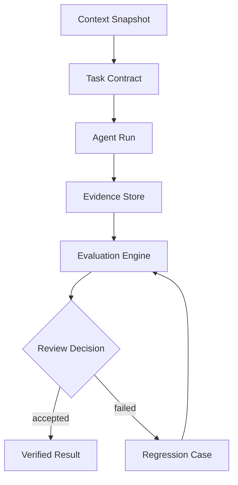
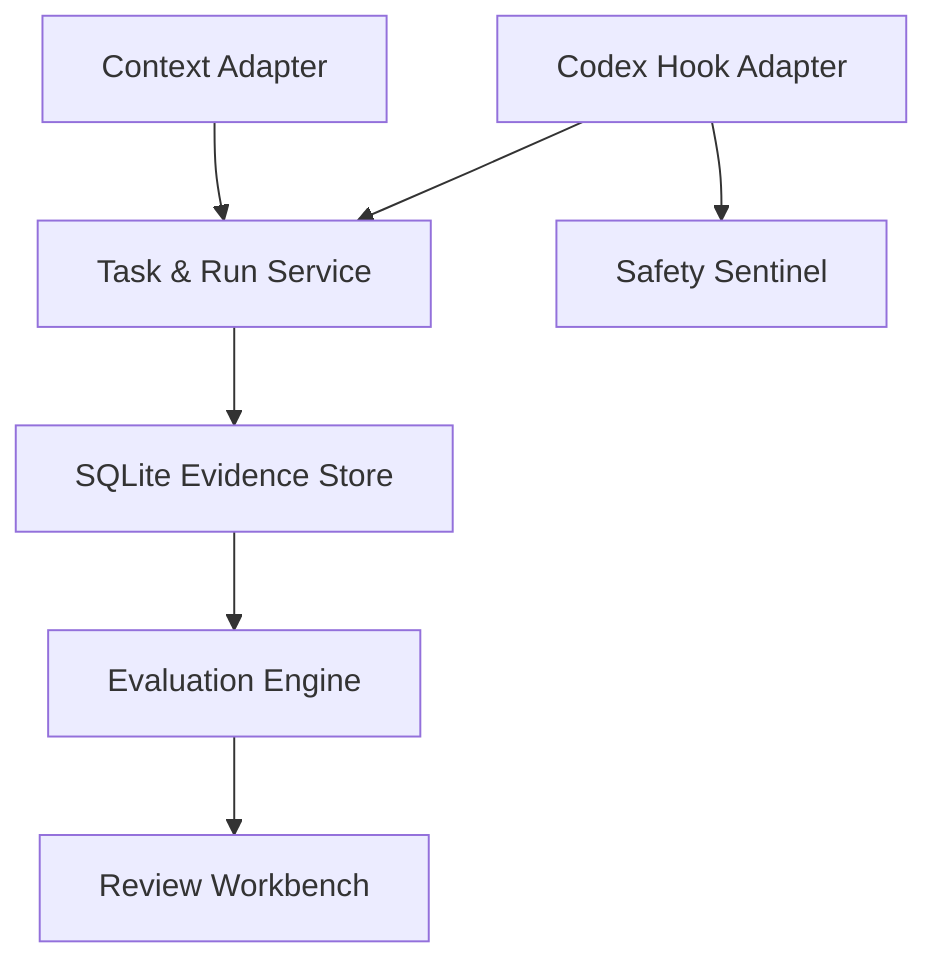
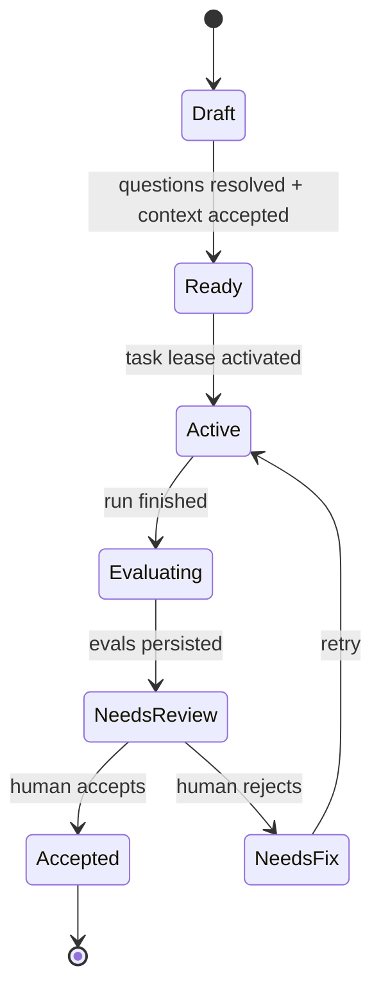

# EvolveTrace — AI Development Harness 设计方案

## 1. 产品定位

EvolveTrace 是一个面向个人多仓库开发的本地优先 AI Development Harness。它把需求、上下文、Agent 执行轨迹、确定性评估和人工复核组织为一条可验证的工程链路。

一句话定义：

> EvolveTrace turns a requirement and a context snapshot into a verifiable execution record and a reusable regression case.

EvolveTrace 保留现有 Codex Hooks、Safety Sentinel、SQLite、SSE 和审查工作台，将其升级为 Harness 的执行证据层，而不是推倒重写。

### 1.1 核心问题

一次 Agent 运行不能只用“最终生成了 diff”判断成功。用户还需要确认：

- 需求、目标仓库、约束与验收标准是否明确
- Agent 使用的上下文来自哪里、是否过期
- Agent 实际调用了哪些工具、修改了哪些文件
- 修改后是否执行了必要验证
- 风险操作是否被识别或阻断
- 每一条验收标准是否存在对应证据
- 失败是否能够稳定复现并进入回归集合

### 1.2 非目标

首个完整闭环不包含：

- 自研 Agent 或模型调用编排
- 大而全的需求管理和团队协作
- 云同步、登录与权限系统
- RAG、向量数据库或长期对话记忆平台
- 隐藏思维链展示
- 完整文件系统沙箱或执行回放虚拟机
- 自动替代人类批准高风险操作

## 2. 设计原则

1. **Evidence over claims**：任何通过或失败结论都必须引用命令结果、事件、diff、快照或人工证据。
2. **Deterministic first**：可以用确定性规则判断的内容不交给 LLM。
3. **Human owns the decision**：高风险、低置信度和语义争议由人类最终确认。
4. **Local first**：服务、数据库、上下文和回归案例默认保存在本机。
5. **Explicit boundaries**：EvolveTrace 不复制 AI Context Kit 的发现逻辑，也不接管 Coding Agent。
6. **Failures become assets**：失败不是一条日志，而是可脱敏、可重放、可比较的 regression case。
7. **Current and planned stay separate**：公开文档必须明确哪些能力已经实现、哪些仍处于路线图。

## 3. 目标闭环



标准流程：

1. 从 AI Context Kit 导出目标项目的版本化上下文快照。
2. 创建 Task Contract，明确目标仓库、约束、验收标准和未决问题。
3. 人工确认任务进入 Ready 状态。
4. Codex 等 Agent 独立执行；EvolveTrace Hooks 采集公开可用的执行证据。
5. Run 结束后运行确定性 Evaluators。
6. 人工结合需求、上下文、轨迹和评估结果做出决定。
7. 失败任务被脱敏并沉淀为 Regression Case；修复后重新运行同一组门禁。

## 4. 三层职责边界

| 系统 | 所有权 | 输出给 EvolveTrace 的内容 |
| --- | --- | --- |
| AI Context Kit | 项目发现、受限事实观察、freshness、人工语义记忆 | `ContextBundle v1` |
| Agent Skills | 工作方法、行为约束和可复用步骤 | Agent 执行时使用，不由 EvolveTrace 存储或解释 |
| EvolveTrace | Task、Run、Evidence、Evaluation、Review、Regression | 可验证运行记录 |

仓库文件始终是事实源。AI Context Kit 是上下文入口，EvolveTrace 是运行和评估入口。

## 5. 系统架构



### 5.1 Context Adapter

Context Adapter 只消费稳定的版本化输出，不读取 AI Context Kit 的内部 Python 模块或私有数据库结构。目标命令为：

```text
aictx export harness <project> --format json --output -
```

EvolveTrace 可以通过 CLI 子进程导入，也可以接收用户选择的本地 JSON 文件。导入完成后保存规范化 JSON、摘要和来源元数据，以保证历史 Run 可复核。

### 5.2 Task & Run Service

Task Service 管理需求契约、上下文绑定和状态流转。Run Service 把现有审计 Session 关联到 Task，但不启动或控制 Agent。

绑定策略：

- 用户可以为一个目标仓库激活 Task。
- Hook 的 SessionStart 根据规范化工作目录匹配活动 Task。
- 同一仓库同时只能存在一个活动 Task lease。
- 未匹配的会话进入 `Unbound Runs`，允许之后人工绑定。
- 工作目录不属于 `target_repositories` 时产生 scope mismatch finding。

### 5.3 Evidence Store

现有 `AuditEvent`、risk finding、SQLite repository 和 SSE 继续使用。新增 Task、Context Snapshot、Run、Evaluation、Review 和 Regression 表，不把原始 Hook payload 重新引入数据库。

### 5.4 Evaluation Engine

Evaluator 使用统一接口，输入为 Task Contract、Context Snapshot、Run 和证据查询接口；输出为结构化 `EvaluationResult`。Evaluator 不直接修改 Task 或 Run 状态，由 Evaluation Service 聚合后流转。

### 5.5 Review Workbench

界面从 Session-first 调整为 Task-first：

- 左侧：Tasks、Runs、Regression Cases
- 中间：需求、上下文、运行、评估组成的生命周期
- 右侧：当前对象的详细证据和人工决定
- 顶部：context freshness、验收通过率、风险与最终状态

原有 Session 时间线作为 Run 的 Evidence 视图继续保留。

## 6. 核心领域模型

### 6.1 TaskContract

| 字段 | 含义 |
| --- | --- |
| `task_id` | 本地稳定标识 |
| `title` | 简洁任务名称 |
| `goal` | 要解决的问题和期望结果 |
| `target_repositories` | 允许操作的仓库及相对范围 |
| `constraints` | 禁止修改、兼容性、隐私和安全限制 |
| `acceptance_criteria` | 机器可验证或人工确认的完成条件 |
| `open_questions` | 尚未确认的问题；非空时不能进入 Ready |
| `risk_level` | `normal`、`high` 或 `destructive` |
| `context_snapshot_id` | 经确认的上下文版本 |
| `status` | Task 生命周期状态 |

### 6.2 ContextSnapshot

| 字段 | 含义 |
| --- | --- |
| `snapshot_id` | 本地稳定标识 |
| `schema_version` | 首版固定为 `context-bundle/v1` |
| `project` | AI Context Kit 项目标识 |
| `generated_at` | 生成时间 |
| `freshness` | `current`、`stale`、`missing` 或 `unknown` |
| `observed_scope` | 自动事实的受限观察范围 |
| `content` | 已脱敏的规范化快照内容 |
| `content_digest` | 规范 JSON 的 SHA-256 |
| `source` | `aictx-cli` 或 `file-import` |

### 6.3 Run

Run 保存 `task_id`、Agent adapter、session id、工作目录、开始/结束时间、开始/结束 commit、运行状态和聚合风险。Session 是外部 Agent 的概念，Run 是 EvolveTrace 的审查单元。

### 6.4 AcceptanceCriterion

首版支持：

- `command_exit_zero`：指定验证命令退出码为 0
- `path_scope`：所有修改位于允许路径
- `file_exists` / `file_absent`：产物存在性
- `event_absent`：不存在指定风险或拒绝事件
- `manual`：必须由人类确认

每一项保存 `criterion_id`、类型、配置、required 标志和解释文本。

### 6.5 EvaluationResult

```text
evaluator_id
evaluator_version
status: passed | failed | needs_review | skipped
severity: info | warning | blocking
summary
evidence_refs[]
expected
actual
created_at
```

### 6.6 ReviewDecision

最终状态为 `accepted`、`needs_fix` 或 `blocked`。决定必须记录操作者、时间、备注以及当时 Evaluation Result 的集合摘要。

### 6.7 RegressionCase

Regression Case 由脱敏后的 Task Contract、Context 摘要、失败分类、输入 fixture、期望 Evaluator 结果和参考修复信息组成。默认只存在于本地；导出前再次执行隐私扫描。

## 7. ContextBundle v1

跨仓库协议使用 JSON，不解析 Markdown 文案：

```json
{
  "schema_version": "context-bundle/v1",
  "project": "example-project",
  "generated_at": "2026-09-09T00:00:00Z",
  "freshness": "current",
  "observed_scope": ["README.md", "package.json", "git metadata"],
  "repositories": [
    {"name": "example-project", "relative_path": "example-project"}
  ],
  "context": {
    "automatic": "Bounded observed facts",
    "manual": "Reviewed goals, constraints and current state"
  }
}
```

约束：

- `schema_version` 不识别时拒绝导入。
- `generated_at` 必须包含时区。
- 不接受本机绝对路径；仓库位置只使用 workspace-relative path。
- digest 由 key 排序、UTF-8、无多余空白的规范 JSON 计算。
- 导入时再次执行 EvolveTrace 脱敏规则。
- 快照一经绑定到 Run 不可原地覆盖，只能创建新版本。

## 8. 确定性评估器

M0.4 首先实现：

| Evaluator | Blocking 条件 |
| --- | --- |
| Context Freshness | required context 为 `stale`、`missing` 或 schema 不兼容 |
| Repository Scope | 修改超出 `target_repositories` 或允许路径 |
| Safety | 出现已阻断破坏性操作或未解释的高风险事件 |
| Verification | required 验证没有运行或退出失败 |
| Acceptance Evidence | required criterion 没有对应证据 |
| Run Quality | 声称成功但没有验证，或重复失败超过配置阈值 |

聚合规则不使用平均分掩盖阻断项：任一 blocking failure 都使 Run 进入 `needs_review`，不能自动 Accepted。

## 9. LLM Judge 边界

LLM Judge 只在 M0.6 作为可选实验模块加入：

- 默认关闭并要求本地显式配置 Provider
- 每个 Judge 只评价一个语义维度
- rubric 使用可版本化、可复现的结构化定义
- 输出必须引用 evidence refs，并允许 `needs_review`
- 保存 model、prompt、rubric 和 evaluator 版本
- 使用 golden、edge、adversarial、held-out 和生产脱敏样本衡量准确率
- 未达到预设一致性前，不作为安全和发布的自动放行门禁

重点观察位置偏差、冗长偏差、自我增强偏差、数据泄漏、污染、reward hacking、含糊 rubric、聚合掩盖、分布漂移、非确定性和 Judge 越权。

## 10. 失败分类与回归集合

首版失败 taxonomy：

- `context.missing`
- `context.stale`
- `scope.wrong_repository`
- `scope.unexpected_path`
- `requirement.ambiguous`
- `acceptance.unverified`
- `safety.destructive_command`
- `execution.repeated_failure`
- `result.claim_without_evidence`
- `privacy.unsanitized_export`

公开仓库中的案例必须是合成 fixture，不得提交真实项目上下文、公司信息、私人仓库内容、凭据、本机绝对路径或可反推个人身份的数据。

## 11. 生命周期



破坏性风险可以把 Run 标记为 `blocked`，但 Task 本身仍保留，允许修改约束后重新执行。

## 12. 使用与分发

开发模式可以继续使用 Next.js 与 FastAPI 两个热更新进程；用户模式目标为：

```text
evolvetrace start
```

- Next.js 构建静态前端产物
- FastAPI 以同源方式提供 UI、API 和 SSE
- 安装包携带前端产物
- 单进程、单端口、localhost-only
- 系统浏览器和 Codex 内置 Browser 使用同一个 URL
- Codex 配套 Skill 负责启动、健康检查并请求内置 Browser 打开页面

第一阶段不引入 Electron 或系统托盘应用。

## 13. 路线图

### M0.3 — Task & Context

- Task Contract 与状态机
- `ContextBundle v1` 协议和 AI Context Kit 导出
- Context Snapshot 导入、摘要与 freshness
- Session-to-Run 绑定和 Unbound Runs
- Task-first 基础页面
- 单进程生产分发

### M0.4 — Evidence-based Evals

- Evaluator 插件接口
- 六类确定性 Evaluator
- Acceptance Criterion 与证据绑定
- Review Decision

### M0.5 — Regression Harness

- 失败 taxonomy
- 脱敏导出、导入和 fixture replay
- 修复前后对比
- golden、edge 和 adversarial 集合

### M0.6 — LLM Judge Experiments

- Provider adapter
- rubric/model/prompt versioning
- gold label 校准
- 偏差、误判和一致性报告

## 14. 成功标准

首个完整 Demo 必须证明：

1. 从 AI Context Kit 导入两个关联仓库的上下文。
2. 创建包含目标、约束和可验证验收标准的 Task。
3. Codex 完成一次真实修改，EvolveTrace 自动关联 Run。
4. 确定性 Evaluator 发现至少一个范围或验证问题。
5. 人工判定 `needs_fix` 并保存 Regression Case。
6. 修正后重新执行，同一组门禁全部通过。
7. 用户能在一个 Task 页面内解释需求、上下文、执行、失败和修复证据。

只有完成这一闭环后，项目才对外声称具备完整 Harness 能力；在此之前应使用“正在演进为 AI Development Harness”的准确表述。
