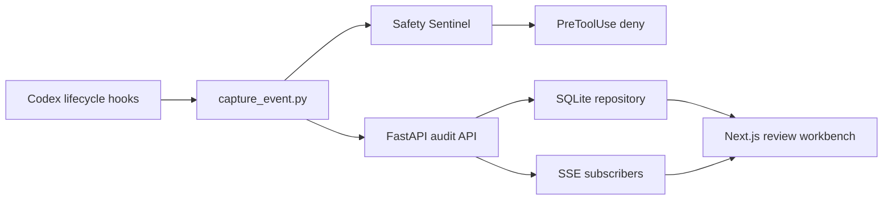

# EvolveTrace — 设计方案

## 产品定位

EvolveTrace 是本地优先的 Coding Agent 执行审查、可观测与执行前安全工作台。第一版以 Codex Hooks 为适配入口，记录可验证的执行证据；对于少数高置信度破坏性 Bash 命令，在执行前返回拒绝，帮助个人开发者发现风险、阻止不可逆操作并给出精确反馈。

它不是另一个 Coding Agent，不展示隐藏思维链，也不把源代码上传云端。

## 核心问题

Agent 最终生成的 diff 不能解释完整过程。用户需要知道：

- 使用了哪些工具和命令
- 哪些步骤申请了权限
- 哪些文件被修改
- 失败后是否重试
- 修改之后是否真正验证
- 高影响操作是否能在执行前被识别和阻止

## 系统架构

### 插件

<code>plugin/.codex-plugin/plugin.json</code> 定义插件身份，<code>plugin/hooks/hooks.json</code> 注册会话、提示词、工具、权限、压缩和停止事件。Hook 通过插件根目录定位采集脚本，读取 stdin JSON，先在本地执行确定性安全策略，再把脱敏后的证据发送到本机 API。

普通采集发送失败时正常退出，不阻断 Codex。Safety Sentinel 仅在 <code>PreToolUse</code> 的 Bash 调用中触发；即使审计后端不可用，高风险拒绝仍会返回给 Codex。

### 后端

<code>backend/audit/</code> 负责审计事件模型、脱敏、SQLite 仓储和确定性风险规则。<code>backend/services/audit_service.py</code> 聚合事件并向 SSE 发布，<code>backend/api/routes.py</code> 只负责 HTTP 转换。

后端只暴露健康检查和审计接口，默认只接受 loopback 审计请求。事件按会话保存，页面刷新后可以从 SQLite 恢复。

### 前端与启动方式

首页是三栏审查工作台：会话列表、执行时间线、事件详情。顶部展示事件、工具、修改文件和风险汇总；用户可以针对具体事件写审查意见并复制结构化修正提示。

根目录 <code>start.ps1</code> 是默认入口：它启动后端和前端、等待健康检查，然后打开工作台。在 ChatGPT 桌面版的 Codex 中，可使用 <code>-NoBrowser</code> 并让 <code>@Browser</code> 打开 localhost 地址，得到对话内的共享审查视图。

## 安全策略边界

第一版只阻断四类高置信度 Bash 操作：

- 格式化或擦除存储设备
- 向物理磁盘直接写入
- 递归删除文件系统根目录、家目录或父目录
- 把网络下载内容直接管道给 shell

普通项目清理和 Git 恢复命令不会被自动阻断，仍会以风险证据记录。Hook 覆盖并非完整，因此 Safety Sentinel 是 Guardrail，不是沙箱或完整执行控制层。

## 数据与隐私

- 默认监听 <code>127.0.0.1</code>
- 原始 Hook payload 不落盘
- API Key、Token、Cookie、JWT、URL 查询凭据和常见密钥格式脱敏
- 事件详情只展示脱敏后的输入和输出
- 不依赖额外 LLM 分析，不发送遥测

## 当前边界

第一版不包含登录、团队权限、云同步、执行回放、隐藏思维链展示、文件系统快照或沙箱。未来适配其他 Coding Agent 时，保持相同审计事件协议，只新增事件采集器。

## 验证

后端测试覆盖事件协议、脱敏、风险、仓储、API、插件采集、Safety Sentinel 和 fixture 回放；前端使用 ESLint 与 Next.js production build 验证类型和构建产物。<code>docs/demo.md</code> 提供无需真实 Codex 的本地演示。
