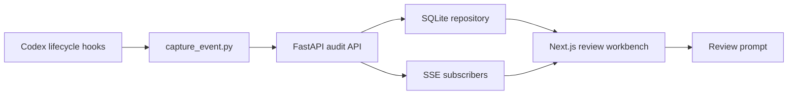

# EvolveTrace — 设计方案

## 产品定位

EvolveTrace 是本地优先的 Coding Agent 执行审查与可观测工作台。第一版以 Codex Hooks 为适配入口，记录可验证的执行证据，帮助个人开发者发现风险、定位步骤并给出精确反馈。

它不是另一个 Coding Agent，不展示隐藏思维链，也不把源代码上传云端。

## 核心问题

Agent 最终生成的 diff 不能解释完整过程。用户需要知道：

- 使用了哪些工具和命令
- 哪些步骤申请了权限
- 哪些文件被修改
- 失败后是否重试
- 修改之后是否真正验证

## 系统架构

### 插件

`plugin/.codex-plugin/plugin.json` 定义插件身份，`plugin/hooks/hooks.json` 注册会话、提示词、工具、权限、压缩和停止事件。Hook 通过 `${PLUGIN_ROOT}` 定位采集脚本，读取 stdin JSON，脱敏后向本机 API 发送；发送失败时正常退出，不阻塞 Codex。

### 后端

`backend/audit/` 负责审计事件模型、脱敏、SQLite 仓储和确定性风险规则。`backend/services/audit_service.py` 聚合事件并向 SSE 发布，`backend/api/routes.py` 只负责 HTTP 转换。

审计接口默认只接受 loopback 请求。事件按会话保存，页面刷新后可以从 SQLite 恢复。

### 前端

首页是三栏审查工作台：会话列表、执行时间线、事件详情。顶部展示事件、工具、修改文件和风险汇总；用户可以针对具体事件写审查意见并复制结构化修正提示。

## 数据与隐私

- 默认监听 `127.0.0.1`
- 原始 Hook payload 不落盘
- API Key、Token、Cookie、JWT、URL 查询凭据和常见密钥格式脱敏
- 事件详情只展示脱敏后的输入和输出
- 不依赖额外 LLM 分析，不发送遥测

## 风险规则

第一版使用确定性规则标记危险命令、权限拒绝、工具失败和高风险执行证据。风险标记是辅助审查，不是对代码安全性的最终判断。

## 当前边界

第一版不包含登录、团队权限、云同步、执行回放和隐藏思维链展示。未来适配其他 Coding Agent 时，保持相同审计事件协议，只新增事件采集器。

## 验证

后端使用 pytest 验证事件协议、脱敏、风险、仓储、API 和插件采集；前端使用 ESLint 和 Next.js production build 验证类型与构建产物。`docs/demo.md` 提供无需真实 Codex 的本地演示。
