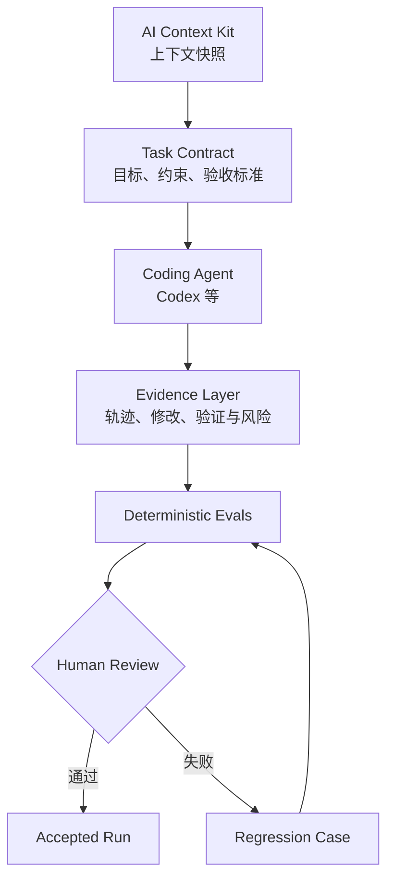

# EvolveTrace

**A local-first AI development harness for context, evidence, and eval-driven workflows.**

EvolveTrace 把一次 Coding Agent 任务从“给出需求”推进到“结果可验证”：它关联任务契约与上下文快照，采集 Agent 暴露的执行证据，运行确定性评估，并把失败沉淀为可复用的回归案例。

当前版本提供 Codex 执行审查、实时可观测和窄范围的执行前安全保护。它基于 Agent 已公开的事件和验证结果构建证据链，不依赖隐藏思维链，也不上传源代码。

## 为什么需要它

Agent 最终生成的 diff 无法回答完整的工程问题：

- 它接到的需求和验收标准是否明确？
- 它使用的项目上下文是否正确、最新？
- 它执行了哪些命令、申请了哪些权限、修改了哪些文件？
- 它是否真正运行了测试、lint 或 build？
- 高风险操作能否在执行前停止？
- 本次失败能否变成下一次自动复测的案例？

EvolveTrace 的目标不是给 Agent 再套一层聊天界面，而是把需求、上下文、轨迹、评估和人工决策组织成一条可审查的证据链。

## 目标工作流



## 项目边界

| 层 | 职责 |
| --- | --- |
| [AI Context Kit](https://github.com/sorenjing/ai-context-kit) | 维护“AI 应该知道什么”，生成可审计、可追踪 freshness 的项目上下文 |
| Agent Skills | 约束“AI 应该怎样工作”，复用开发行为与流程 |
| EvolveTrace | 记录“AI 做了什么、是否做对、失败如何复现” |

首个完整闭环面向个人多仓库开发，聚焦任务上下文、执行证据、安全检查和回归评估。

## 当前已实现

- Codex lifecycle Hooks 事件采集
- 本地 SQLite 会话与事件存储
- SSE 实时执行时间线
- 输入输出脱敏和 loopback-only API
- 危险命令、权限拒绝、失败调用与修改范围的确定性风险标记
- Safety Sentinel 执行前阻断
- 三栏审查工作台与可复制的修正提示
- `start.ps1` 一键启动前后端，并支持 Codex 内置 Browser
- 后端测试、前端 lint/build 与 GitHub Actions CI

## 快速开始

完成一次性依赖安装后，在仓库根目录运行：

```powershell
./start.ps1
```

在 ChatGPT 桌面版 Codex 中希望使用内置 Browser：

```powershell
./start.ps1 -NoBrowser
```

然后让 Codex 打开 `http://127.0.0.1:3000`。完整环境配置和演示流程见 [RUN.md](RUN.md) 与 [docs/demo.md](docs/demo.md)。

## Safety Sentinel 边界

第一版只对 Codex `PreToolUse` 暴露的 Bash 命令做确定性判断，并阻断四类高置信度操作：

- 格式化或擦除存储设备
- 直接向物理磁盘写入
- 递归删除文件系统根目录、家目录或父目录
- 将网络下载内容直接管道给 shell 执行

普通项目清理和 Git 恢复命令仍会记录并标记风险，但不会自动阻断。Hook 覆盖并不完整，因此 Safety Sentinel 是 Guardrail，而不是完整沙箱。

## 下一阶段

- **M0.3 Task & Context**：Task Contract、`ContextBundle v1`、Run 绑定、任务中心界面和单进程分发
- **M0.4 Evidence-based Evals**：确定性 Evaluator、验收证据和人工 Review Decision
- **M0.5 Regression Harness**：失败分类、脱敏案例、重放与修复前后对比
- **M0.6 LLM Judge Experiments**：可选 Judge、rubric/version、gold labels 和偏差评估

详细设计见 [DESIGN.md](DESIGN.md)，首个里程碑实施计划见 [Task & Context implementation plan](docs/superpowers/plans/2026-09-09-task-context-milestone.md)。

## 数据与隐私

- 默认只监听 `127.0.0.1`
- 原始 Hook payload 不落盘
- 常见 API Key、Token、Cookie、JWT 和 URL 凭据会脱敏
- 不上传源代码，不依赖云账号
- Context Snapshot 和 Regression Case 默认只保存在本地
- 公开 fixtures 只能使用合成数据，不得包含真实 `.ai/` 内容、公司信息、私人仓库内容或本机绝对路径

## 开发与验证

在个人电脑上执行：

```powershell
cd backend
venv\Scripts\python.exe -m pip install -r requirements-dev.txt
venv\Scripts\python.exe -m pytest -q
cd ..
npm run lint
npm run build
```

## License

本项目沿用仓库中的 PolyForm Noncommercial License，详见 [LICENSE](LICENSE)。
