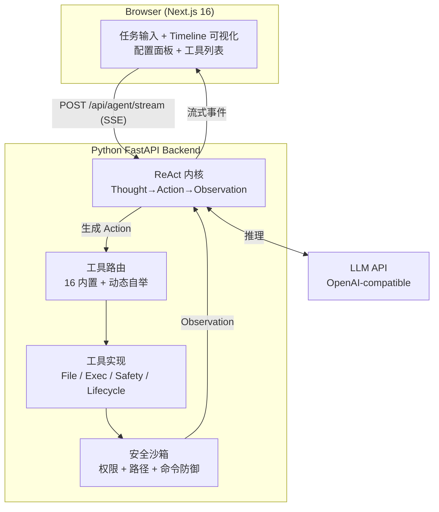

# EvolveLab

<p align="center">
  <strong>一个公开维护的源码项目，用来探索 Coding Agent 的可观测性、工具扩展与安全边界</strong><br>
  把 Agent 当成工程系统来理解，而不只是看最终结果
</p>

<p align="center">
  
  
  
  
  
</p>

<p align="center">
  <a href="#这是什么">这是什么</a> ·
  <a href="#和-cursorcodexclaude-code-有什么不同">差异化</a> ·
  <a href="#能做什么">能做什么</a> ·
  <a href="#快速开始">快速开始</a> ·
  <a href="#架构">架构</a> ·
  <a href="#安全设计">安全设计</a>
</p>

---

## 这是什么？

EvolveLab 是一个**公开维护的源码项目**，我用它来研究 Coding Agent 的三个核心问题：

1. **过程为什么会走偏**：很多 Agent 给结果，但中间推理过程和失败原因并不清楚
2. **工具为什么不够灵活**：固定工具集很难覆盖具体仓库和具体任务
3. **改代码为什么不够安全**：让 Agent 直接执行命令或修改文件，缺少可验证、可回滚的安全边界

围绕这三个问题，EvolveLab 重点实现了：

- **白盒 Timeline**：把 Thought -> Action -> Observation 全过程实时展示出来
- **运行时工具扩展**：Agent 可以创建新工具并持久化加载
- **改码安全层**：在修改代码前后加入 Git 快照、构建验证和失败回滚

它**不是**一个成熟的商业化产品，也**不是**低门槛的通用代码助手。它更适合被理解为：

- 一个研究 Agent 行为和失败路径的白盒工作台
- 一个围绕工具系统与安全边界做工程实验的源码项目
- 一个用于展示 Agent / DevTools / AI Infra 工程思考的个人项目

如果你想先理解这个项目适合怎么被使用、哪里有边界，可以先看 [docs/positioning.md](docs/positioning.md)；如果你更关心实现细节，可以继续看 [DESIGN.md](DESIGN.md)。

## 和 Cursor/Codex/Claude Code 有什么不同？

| 维度 | Cursor / Codex / Claude Code | EvolveLab |
|------|------------------------------|-----------|
| **过程可见性** | 黑盒，只给结果 | 白盒，可查看关键步骤与工具调用 |
| **工具系统** | 固定内置 | 可动态创建/删除，支持运行时扩展 |
| **定位** | 代码助手（结果导向） | 研究型工作台（机制与安全导向） |
| **内核** | 闭源或托管 | 自研 ReAct 内核，源码开放（非商业许可） |
| **数据** | 部分经过云端 | 完全本地运行 |

**一句话**：它们更强调直接交付结果，EvolveLab 更强调看清 Agent 如何运行，以及如何给它加上可观测性和安全边界。

## 能做什么

### 示例 1：让 Agent 分析你的项目

```
任务：分析这个项目的结构，找出主要模块

Agent 执行轨迹：
  Step 1  THOUGHT  我需要先看根目录有哪些文件
          ACTION   list_files(path=".")
          OBSERVE  backend/  src/  package.json  README.md ...

  Step 2  THOUGHT  有 backend 和 src，先看 backend 结构
          ACTION   list_files(path="backend")
          OBSERVE  agent/  api/  auth/  tools/  main.py ...

  Step 3  THOUGHT  读 main.py 了解入口
          ACTION   read_file(path="backend/main.py")
          OBSERVE  FastAPI 应用，注册了路由...

  ✅ 结果：这是一个前后端分离的 Coding Agent 源码项目，后端 FastAPI
          提供 ReAct 内核、工具系统与安全机制，前端 Next.js 做 Timeline 可视化...
```

### 示例 2：让 Agent 给自己加一个新工具

```
任务：我需要一个能把文本翻译成英文的工具，你创建一下

Agent 执行轨迹：
  Step 1  THOUGHT  现有工具没有翻译能力，我用 create_tool 创建
          ACTION   create_tool(
                     name="translate_to_en",
                     description="将中文文本翻译为英文",
                     args=["text"],
                     code="def run(**kwargs): ..."
                   )
          OBSERVE  [成功] 工具 'translate_to_en' 已创建并注册

  Step 2  THOUGHT  测试一下新工具
          ACTION   translate_to_en(text="你好世界")
          OBSERVE  Hello World

  ✅ 结果：已创建翻译工具，持久化保存，重启后仍可用
```

### 示例 3：让 Agent 修改代码并安全验证

```
任务：在 backend/tools 下加一个计算器工具

Agent 执行轨迹：
  Step 1  THOUGHT  修改项目源码前必须先创建快照
          ACTION   create_snapshot()
          OBSERVE  [成功] 快照 ID: a1b2c3d4

  Step 2  THOUGHT  写入计算器工具代码
          ACTION   write_file(path="backend/tools/custom/calc.py", content="...")
          OBSERVE  文件已写入

  Step 3  THOUGHT  验证修改没有破坏项目
          ACTION   verify_build()
          OBSERVE  [成功] 构建验证通过

  ✅ 结果：计算器工具已添加，构建验证通过
```

## 核心特性

- **白盒 Timeline** — 实时渲染 Agent 的 Thought → Action → Observation 闭环，每一步都看得见
- **自研 ReAct 内核** — 不依赖 LangChain/AutoGen，从零实现推理循环，强制结构化 JSON 输出，死循环检测 + 上下文压缩
- **可定制工具系统** — 16 个内置工具 + Agent 运行时自举新工具，持久化到本地，重启后自动加载
- **自我修改安全层** — Git 快照 → 修改 → 构建验证 → 失败自动回滚，让 Agent 改自己的代码也不会崩
- **多层安全沙箱** — 命令注入三层防御、路径越界防护、角色权限分级、管理接口认证
- **完全本地运行** — 代码不离开你的电脑，API Key 存浏览器 localStorage，不碰文件系统

## 快速开始

### 1. 克隆仓库

```bash
git clone https://github.com/sorenjing/EvolveLab.git
cd EvolveLab
```

### 2. 启动后端

```bash
cd backend
python -m venv venv

# Windows
.\venv\Scripts\pip install -r requirements.txt
.\venv\Scripts\uvicorn main:app --host 127.0.0.1 --port 8001 --reload

# Linux / macOS
source venv/bin/activate
pip install -r requirements.txt
uvicorn main:app --host 127.0.0.1 --port 8001 --reload
```

### 3. 启动前端

```bash
# 回到项目根目录
npm install
npm run dev
```

浏览器访问 **http://localhost:3000**：

1. 点击右上角「设置」→ 填入 API Key → 测试连接 → 保存
2. 输入任务（如"分析这个项目的结构"）→ 点「执行」
3. 观察 Timeline 上 Agent 的实时思考过程

> **Windows 一键启动**：`.\start.ps1`

### 配置 API Key

API Key 在前端界面配置，保存在浏览器 localStorage，**不写入文件、不上传 GitHub**：

| 字段 | 说明 | 默认值 |
|------|------|--------|
| API Key | LLM API 密钥（必填） | — |
| Base URL | LLM API 地址 | `https://open.bigmodel.cn/api/paas/v4` |
| Model | 模型名称 | `glm-4-flash` |

<details>
<summary>支持的 LLM 提供商</summary>

| 提供商 | BASE_URL | 推荐 Model |
|--------|----------|-----------|
| 智谱 AI | `https://open.bigmodel.cn/api/paas/v4` | `glm-4-flash` |
| Moonshot | `https://api.moonshot.cn/v1` | `moonshot-v1-8k` |
| OpenAI | `https://api.openai.com/v1` | `gpt-4o-mini` |
| DeepSeek | `https://api.deepseek.com` | `deepseek-chat` |

</details>

## 架构



## 技术栈

| 层级 | 选型 | 说明 |
|------|------|------|
| 前端 | Next.js 16 + React 19 + TypeScript | App Router, Tailwind CSS v4 |
| 后端 | Python 3.10+ + FastAPI + Uvicorn | SSE 流式推送 |
| LLM | OpenAI-compatible API | 默认智谱 GLM-4-Flash，可换任意兼容模型 |
| 通信 | SSE (Server-Sent Events) | 端到端流式 |

## 安全设计

Agent 能执行命令和修改文件，因此安全是第一优先级：

### 命令注入防御（三层）

1. **黑名单正则** — 拦截 `rm -rf`、`format`、`del /f` 等危险命令
2. **元字符禁用** — 禁止 `;` `&` `|` `` ` `` `$` `>` `<` 等 shell 元字符
3. **精确白名单** — `shlex` 解析后精确匹配白名单（`npm install` 放行，`npm; rm -rf` 拦截）

### 其他安全机制

- **路径沙箱** — 文件操作限制在项目目录内
- **写前备份** — 修改前自动创建 `.bak` 备份
- **角色权限** — 只读 / 标准 / 管理员三级权限
- **管理接口认证** — `/api/admin/*` 默认仅 localhost，远程需 `ADMIN_TOKEN`
- **速率限制** — 全局 30/min，Agent 接口 10/min，防止额度滥用
- **默认 localhost** — 服务默认监听 `127.0.0.1`，不暴露公网

### 自我修改安全层

Agent 修改自身源码时的保护流程：

| 阶段 | 操作 | 工具 |
|------|------|------|
| 修改前 | 创建 Git 快照 | `create_snapshot` |
| 修改 | 写入/编辑文件 | `write_file` / `edit_file` |
| 验证 | 后端语法 + 前端类型检查 | `verify_build` |
| 回滚 | 验证失败时恢复 | `rollback` |

## 当前状态

### 已完成的核心能力

- **基础 ReAct Loop**：Thought -> Action -> Observation 推理循环 + 工具系统 + 前端 Timeline
- **安全加固**：命令注入三层防御、路径沙箱、会话 TTL、速率限制、管理接口认证
- **改码安全层**：Git 快照 + 构建验证 + 失败自动回滚
- **运行时工具扩展**：`create_tool` 动态注册 + 本地持久化 + 重启自动加载
- **工程化优化**：LLM 重试、AST 代码安全审查、结构化日志、命令输出截断、基础测试

### 当前边界

- 它更适合研究 Agent 机制，而不是直接替代现有代码助手
- 当前更强调单 Agent 白盒可观测与安全执行，不强调复杂协作编排
- 适合作为源码项目阅读、实验和扩展，暂时不追求低门槛产品体验

## 后续方向

如果继续演进，我会优先关注下面几个方向：

- **更强的失败恢复**：Reflection、进度停滞检测、更好的错误恢复策略
- **更好的 Timeline 体验**：折叠分组、筛选、详情面板、轨迹导出
- **更强的安全隔离**：更细粒度权限控制、运行时隔离、Prompt 注入防护
- **更完整的工程能力**：测试覆盖、轻量持久化、CI/CD 和部署脚本完善

## 延伸阅读

- [DESIGN.md](DESIGN.md)：架构与设计取舍
- [docs/usage.md](docs/usage.md)：使用方式与基础说明
- [docs/positioning.md](docs/positioning.md)：项目定位、边界与适用场景

## 贡献

欢迎 Issue 和 PR！详见 [CONTRIBUTING.md](CONTRIBUTING.md)。

提 PR 前请确保：

1. 后端代码通过 `python -m py_compile` 语法检查
2. 前端代码通过 `npm run build` 构建检查
3. 不要提交 `.env` 等含敏感信息的文件

## License

本项目采用 [PolyForm Noncommercial License 1.0.0](LICENSE)。

- ✅ **允许**：个人学习、研究、教学、内部非商用使用、修改与再分发（须保留本许可）
- ❌ **禁止**：未经授权的商用——包括但不限于销售本软件、嵌入付费产品/付费服务、作为 SaaS 提供、用于支撑付费业务的内部使用

如需商用，请通过 GitHub Issues 联系作者获取商业授权。

> 个人项目，独立维护，感谢理解与支持。
