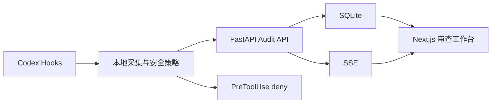

# EvolveTrace

Local review, observability, and pre-execution safety for coding agents.

EvolveTrace 是一个本地优先的 Codex 执行审查工作台。它不重新实现 Coding Agent，也不展示隐藏思维链，而是把 Codex 暴露的任务、工具调用、权限、修改和验证事件整理成可审查的工程记录；对少数高置信度破坏性本地命令，它会在执行前阻断。

## 为什么需要它

Coding Agent 可以在几分钟内完成大量文件读取和修改，但用户通常只能在最后看到结果。真正难审查的是中间过程：它执行了哪些命令？修改范围是否过大？失败后有没有重试？修改之后是否验证？如果它要执行可能损坏磁盘或越过项目边界的命令，能否在执行前停下来？

EvolveTrace 解决的是这个“过程不可审查、风险发现过晚”问题：

- 实时查看任务、工具和权限事件
- 按会话恢复历史执行轨迹
- 对危险命令、权限拒绝和失败调用标记风险
- 在执行前阻断磁盘格式化、物理磁盘写入、越出工作区的递归删除与远程脚本直灌 shell
- 展示脱敏后的执行证据
- 针对具体步骤生成可复制的 Codex 修正提示

## 快速开始

完成一次性依赖安装后，在仓库根目录运行 <code>./start.ps1</code>。它会启动本地审计服务与审查工作台、等待两者就绪，然后自动打开仪表盘。

在 ChatGPT 桌面版的 Codex 中，希望把工作台开在内置浏览器而不是 Chrome 时，运行 <code>./start.ps1 -NoBrowser</code>，再在 Codex 对话中使用 <code>@Browser</code> 打开 <code>http://127.0.0.1:3000</code>。该页面会成为与对话共享的本地审查视图；Codex CLI 或没有内置浏览器的环境仍可使用普通浏览器。

一次性环境配置、手动启动和演示流程见 [RUN.md](RUN.md) 与 [docs/demo.md](docs/demo.md)。

## 安装 Codex 插件

插件源码位于 <code>plugin/</code>，包含插件清单和生命周期 Hooks。将插件加入本地 Codex marketplace 后启用它；Hooks 会把事件发送到 <code>http://127.0.0.1:8001/api/audit/events</code>。

非安全事件的采集采用 best-effort：后端未运行时，采集会在短超时后正常退出，不会阻断 Codex。Safety Sentinel 的高风险阻断在 Hook 本地完成，因此不会因审计服务不可用而失效。

## Safety Sentinel 边界

Safety Sentinel 只对 Codex <code>PreToolUse</code> 暴露的 Bash 命令执行确定性判断。第一版仅阻断四类高置信度操作：

- 格式化或擦除存储设备
- 直接向物理磁盘写入
- 递归删除文件系统根目录、家目录或父目录
- 将网络下载内容直接管道给 shell 执行

普通项目清理和 Git 恢复命令仍会记录并标记风险，但不会被自动阻断。Hooks 不覆盖所有工具路径，因此这是一层本地防护，而非完整沙箱。

## 设计边界

- 只展示 Codex Hooks 暴露的执行证据，不声称展示隐藏思维链
- 默认只监听 localhost，审计数据保存在本地 SQLite
- 原始 Hook payload 不落盘，常见 API Key、Token、Cookie、JWT 和 URL 凭据会脱敏
- 不上传源代码，不依赖额外 LLM，不需要云账号
- 第一版不包含登录、团队权限、云同步、执行回放或文件系统沙箱

## 架构

后端审计模块位于 <code>backend/audit/</code>，HTTP 层只暴露健康检查和 <code>/api/audit/*</code>，存储和风险分析位于服务层。前端审计类型和 API 客户端位于 <code>src/app/lib/</code>，页面组件位于 <code>src/app/components/</code>。

## 开发与验证

在个人电脑上执行：<code>cd backend; venv\Scripts\python.exe -m pip install -r requirements-dev.txt; venv\Scripts\python.exe -m pytest -q</code>，然后回到根目录执行 <code>npm run lint</code> 和 <code>npm run build</code>。

## 项目状态

当前版本是面向个人开发者的本地 MVP：Codex 适配器、执行前安全策略、事件存储、确定性风险规则、实时审查工作台和可复现 Demo 已包含在仓库中。未来可以在不改变审计协议的前提下增加其他 Coding Agent 适配器。

## License

本项目沿用仓库中的 PolyForm Noncommercial License，详见 [LICENSE](LICENSE)。
