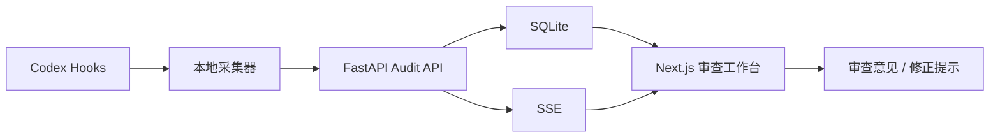

# EvolveTrace

Local review and observability for coding agents.

EvolveTrace 是一个本地优先的 Codex 执行审查工作台。它不重新实现 Coding Agent，也不展示隐藏思维链，而是把 Codex 暴露的任务、工具调用、权限、修改和验证事件整理成可审查的工程记录。

## 为什么需要它

Coding Agent 可以在几分钟内完成大量文件读取和修改，但用户通常只能在最后看到结果。真正难审查的是中间过程：它执行了哪些命令？修改范围是否过大？失败后有没有重试？修改之后是否验证？

EvolveTrace 解决的是这个“过程不可审查”问题：

- 实时查看任务、工具和权限事件
- 按会话恢复历史执行轨迹
- 对危险命令、权限拒绝和失败调用标记风险
- 展示脱敏后的执行证据
- 针对具体步骤生成可复制的 Codex 修正提示

## 界面预览

```text
┌─────────────┬──────────────────────────┬─────────────────────┐
│ Sessions     │ Review workspace         │ Evidence            │
│              │                          │                     │
│ task-8c2...  │ 24 events   6 tools      │ PostToolUse / Bash   │
│ task-2af...  │ 2 files     1 risk       │ command: ...         │
│              │                          │ [risk explanation]  │
│              │ ① User prompt            │                     │
│              │ ② PreToolUse             │ Review this step    │
│              │ ③ PostToolUse            │ [copy repair prompt]│
└─────────────┴──────────────────────────┴─────────────────────┘
```

## 快速开始

### 1. 启动后端

```powershell
cd backend
venv\Scripts\python.exe -m uvicorn main:app --host 127.0.0.1 --port 8001 --reload
```

如果没有虚拟环境：

```powershell
python -m venv venv
venv\Scripts\pip.exe install -r requirements.txt
```

### 2. 启动前端

```powershell
npm install
npm run dev
```

打开 <http://localhost:3000>。

### 3. 安装 Codex 插件

插件源码位于 `plugin/`，包含 `.codex-plugin/plugin.json` 和 `hooks/hooks.json`。将插件加入本地 Codex marketplace 后启用它；Hooks 会把事件发送到 `http://127.0.0.1:8001/api/audit/events`。

如果后端没有运行，Hook 会在短超时后正常退出，不会阻断 Codex。

### 4. 运行演示

后端启动后执行：

```powershell
cd backend
venv\Scripts\python.exe scripts\seed_demo.py
```

返回前端刷新页面，即可看到一条带风险提示、工具调用和审查证据的示例会话。详细演示流程见 [`docs/demo.md`](docs/demo.md)。

## 设计边界

- 只展示 Codex Hooks 暴露的执行证据，不声称展示隐藏思维链
- 默认只监听 localhost，审计数据保存在本地 SQLite
- 原始 Hook payload 不落盘，常见 API Key、Token、Cookie、JWT 和 URL 凭据会脱敏
- 不上传源代码，不依赖额外 LLM，不需要云账号
- 第一版不包含登录、团队权限、云同步和执行回放

## 架构



后端审计模块位于 `backend/audit/`，HTTP 层只暴露健康检查和 `/api/audit/*`，存储和风险分析位于服务层。前端审计类型和 API 客户端位于 `src/app/lib/`，页面组件位于 `src/app/components/`。

## 开发与验证

```powershell
cd backend
venv\Scripts\python.exe -m pip install -r requirements-dev.txt
venv\Scripts\python.exe -m pytest -q
cd ..
npm run lint
npm run build
```

## 项目状态

当前版本是面向个人开发者的本地 MVP：Codex 适配器、事件存储、确定性风险规则、实时审查工作台和可复现 Demo 已包含在仓库中。未来可以在不改变审计协议的前提下增加其他 Coding Agent 适配器。

## License

本项目沿用仓库中的 PolyForm Noncommercial License，详见 [`LICENSE`](LICENSE)。
