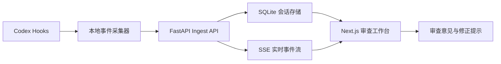

# EvolveTrace 产品与技术设计

## 产品定位

EvolveTrace 是面向 Coding Agent 的本地执行审查与可观测工具。第一版以 Codex 插件为入口，将用户任务、工具调用、权限请求、文件修改、验证结果和子 Agent 活动整理成可实时查看、可复盘、可反馈的工程记录。

产品不重新实现 Coding Agent，也不声称展示隐藏思维链。它只呈现 Codex 通过稳定接口暴露的执行证据。

## 目标用户与痛点

目标用户是使用 Codex 完成真实开发任务的个人开发者。核心痛点是：任务执行时间长、工具调用多、修改范围不透明，用户难以及时发现未验证修改、危险操作和重复失败，也难以针对某一步给出精确反馈。

## 核心闭环

1. 用户安装并启用 EvolveTrace for Codex。
2. Codex Hooks 将生命周期事件写入本地采集器。
3. FastAPI 按会话和轮次聚合事件并通过 SSE 实时推送。
4. Next.js 工作台展示会话、时间线、事件详情和风险摘要。
5. 用户针对具体事件编写意见，系统生成带上下文的修正提示。
6. 用户将修正提示发送给 Codex，继续原任务。

## 系统架构

### 插件层

插件目录包含 `.codex-plugin/plugin.json`、`hooks/hooks.json` 和一个无第三方依赖的 Python 采集脚本。脚本从 stdin 读取 Hook JSON，执行敏感字段脱敏，然后向 `127.0.0.1` 上的 FastAPI 发送事件。服务不可用时脚本正常退出，不影响 Codex。

### 服务层

后端新增独立的审计领域模型、SQLite 仓储和服务层。事件以 `session_id`、`turn_id`、`sequence` 排序。写入成功后发布给进程内订阅者，SSE 路由只负责协议转换。

### 风险分析

第一版仅使用确定性规则：危险命令、敏感信息、修改后缺少验证、工具连续失败、权限拒绝和高修改量。规则输出稳定的风险代码、级别和说明，不调用额外模型。

### 前端层

工作台采用三栏布局：会话列表、执行时间线、事件详情。顶部显示工具调用数、修改文件数、验证状态和风险数量。事件详情支持审查意见，并生成结构化修正提示。

## 数据模型

`sessions` 保存会话状态、工作目录、模型、开始时间、结束时间和汇总指标。`events` 保存事件类型、工具名、脱敏后的输入输出、时间、风险和序号。`reviews` 保存事件级审查意见和生成的修正提示。

原始 Hook payload 不落盘；只保存协议允许的字段和脱敏后的 JSON。

## 隐私与可靠性

- 服务默认仅监听 `127.0.0.1`。
- 数据默认保存在本地 SQLite。
- API Key、Token、Authorization、Cookie 和常见密钥格式必须脱敏。
- Hook 网络请求设置短超时，任何异常都以退出码 0 结束。
- SSE 断线不影响事件写入，刷新页面可从 SQLite 恢复。
- 支持删除单个会话和按保留天数清理历史。

## 第一版范围

包含品牌转型、统一审计协议、Codex Hooks 插件、本地持久化、会话与事件 API、SSE 工作台、基础风险规则、审查反馈和可复现 Demo。

不包含登录、云同步、团队权限、隐藏思维链、额外 LLM 分析、多 Agent 平台适配和执行回放。

## 验收标准

- 插件启用后可采集 Codex 支持的本地工具事件。
- Web 页面实时显示新事件，刷新后历史仍存在。
- 敏感字段不会明文保存。
- 后端未运行时 Hook 不阻断 Codex。
- 页面明确区分执行证据和推断出的风险。
- 用户可针对事件生成结构化修正提示。
- 后端测试、前端 lint 和生产构建通过。

